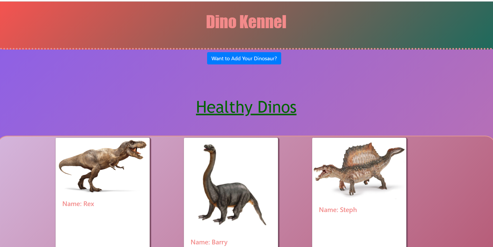
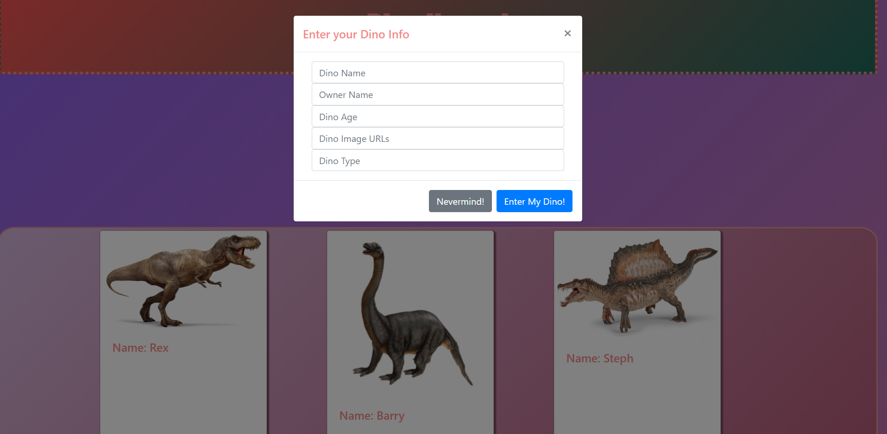

# Dino Kennel

## The first project for NSS Evening Cohort 13

## Description
This app lets you view dinosaurs in a kennel. The dinosaurs are sorted between healthy, sick, and dead dinousaurs. You can also add your own dinosaur with a picture as well. You can pet, feed, and send the dinosaurs on an adventure. If you believe the dinosaur does not belong in the kennel, you may remove the dinosaur from the kennel by clicking the "remove" button.

## Screenshots
### Full Page view

## How to Run
1. Clone down this repo
1. Make sure you have http-server installed via npm. If not get it [HERE](https://www.npmjs.com/package/http-server).
1. On your command line run `hs -p 9999`
1. In your browser go to `http://localhost:9999`
